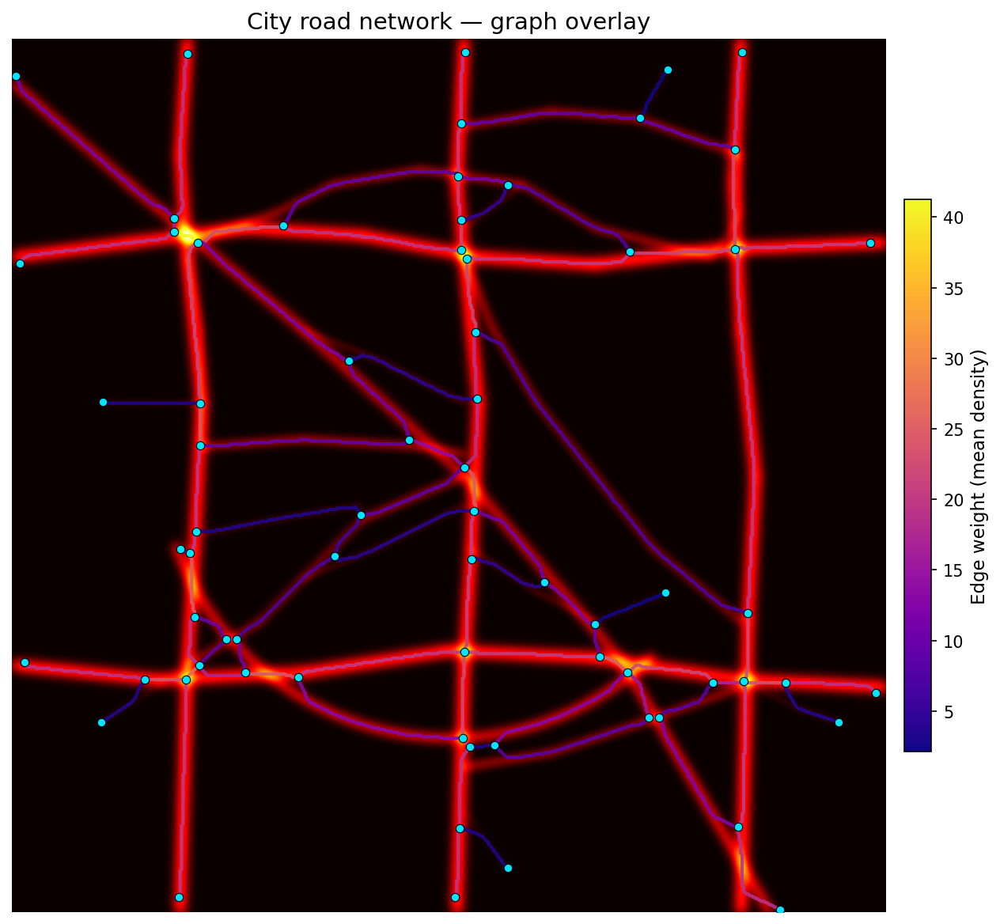
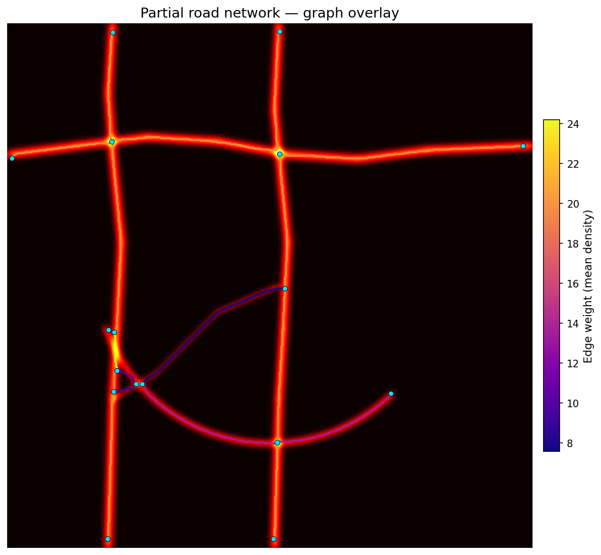

# Road Vectorizer

Convert 2D density histograms into minimal, weighted **NetworkX** graphs.

Given a density map (e.g. GPS trace heatmap, traffic density raster), the
package extracts the road centrelines and returns a clean undirected graph
where each edge follows the actual road path and carries a density-based
weight.

## Full city road network (69 nodes, 90 edges)



## Partial road network (17 nodes, 19 edges) — coverage: 37.9%



---

## Installation

```bash
pip install numpy scipy scikit-image networkx matplotlib
```

No separate install needed — just clone the repo and import:

```python
from road_vectorizer import build_graph, compute_road_coverage, plot_graph_overlay
```

## Quick Start

```python
import numpy as np
from road_vectorizer import build_graph, plot_graph_overlay

density = np.load("my_density_map.npy")

G = build_graph(density)
plot_graph_overlay(density, G)
```

## API Reference

### `build_graph(density_map, **kwargs) → nx.Graph`

Convert a 2D density histogram into a weighted undirected graph.

| Parameter | Type | Default | Description |
|---|---|---|---|
| `density_map` | `np.ndarray` | *required* | 2D array of non-negative density values |
| `threshold` | `float \| None` | `None` | Binarization threshold. `None` → Otsu auto-threshold |
| `dilate_radius` | `int` | `0` | Dilation before skeletonization (helps connect fragmented roads) |
| `prune_length` | `int` | `0` | Max length of dead-end spurs to remove (pixels) |
| `merge_distance` | `int` | `5` | Cluster nodes within this many pixels into one |

**Returns:** `nx.Graph` with:
- **Nodes:** `pos = (col, row)` for plotting
- **Edges:** `weight` (mean density), `max_density`, `length` (pixels), `path` (list of `(row, col)` coordinates)

```python
G = build_graph(density, threshold=0.3, prune_length=5, merge_distance=5)
```

---

### `compute_road_coverage(full_graph, partial_graph, tolerance=2) → dict`

Compute what fraction of a full road network is present in a partial one.

For each edge in the full graph, checks how many of its path pixels lie
within `tolerance` pixels of any path pixel in the partial graph.

| Parameter | Type | Default | Description |
|---|---|---|---|
| `full_graph` | `nx.Graph` | *required* | Reference graph (from full density map) |
| `partial_graph` | `nx.Graph` | *required* | Graph from partial density map (some roads removed) |
| `tolerance` | `int` | `2` | Pixel tolerance for fuzzy matching (L∞ distance) |

**Returns:** dict with:
- `"coverage"` — overall fraction `[0, 1]`
- `"edges"` — per-edge breakdown (`u`, `v`, `length`, `covered_pixels`, `edge_coverage`)

```python
full_graph = build_graph(full_density, threshold=0.3)
partial_graph = build_graph(partial_density, threshold=0.3)

result = compute_road_coverage(full_graph, partial_graph, tolerance=2)
print(f"Coverage: {result['coverage']:.1%}")  # e.g. "Coverage: 37.9%"
```

---

### `plot_graph_overlay(density_map, graph, **kwargs) → Axes`

Draw the density map with the extracted graph overlaid.

| Parameter | Type | Default | Description |
|---|---|---|---|
| `density_map` | `np.ndarray` | *required* | Original 2D density histogram |
| `graph` | `nx.Graph` | *required* | Graph from `build_graph` |
| `edge_cmap` | `str` | `"winter"` | Colormap for weight-based edge colouring |
| `color_edges_by_weight` | `bool` | `True` | Colour edges by their `weight` attribute |
| `edge_color` | `str \| None` | `None` | Fixed colour override for all edges |
| `node_color` | `str` | `"#00e5ff"` | Node colour |
| `node_size` | `int` | `40` | Node marker size |
| `edge_width` | `float` | `2.0` | Edge line width |
| `save_path` | `str \| None` | `None` | Save figure to this path |
| `show` | `bool` | `True` | Call `plt.show()` |

```python
plot_graph_overlay(density, G, save_path="overlay.png", show=False, edge_cmap="plasma")
```

## Pipeline

```
density_map
    │
    ▼
┌─────────────┐     Otsu or manual threshold
│  Binarize   │────────────────────────────────▶  binary mask
└─────────────┘
    │
    ▼
┌──────────────┐    skimage.morphology.skeletonize
│ Skeletonize  │───────────────────────────────▶  1 px wide centrelines
└──────────────┘
    │
    ▼
┌─────────────┐     pixels with ≠ 2 neighbours
│ Find Nodes  │────────────────────────────────▶  junctions + endpoints
└─────────────┘
    │
    ▼
┌──────────────┐    walk skeleton between nodes
│ Trace Edges  │───────────────────────────────▶  raw edges + density
└──────────────┘
    │
    ▼
┌──────────────┐    1. Euclidean clustering of nearby nodes
│  Simplify    │    2. Contract degree-2 chain nodes
│              │    3. Prune dead-end spurs
└──────────────┘
    │
    ▼
  nx.Graph
```

## Examples

| Example | Description |
|---|---|
| `examples/example_usage.py` | Simple 200×200 synthetic map (5 roads) |
| `examples/complex_example.py` | 400×400 map with grid, roundabout, curves |
| `examples/city_example.py` | 600×600 organic city network + coverage demo |

```bash
python examples/city_example.py
```

## Dependencies

- Python ≥ 3.10
- numpy
- scipy
- scikit-image
- networkx
- matplotlib

## License

MIT
